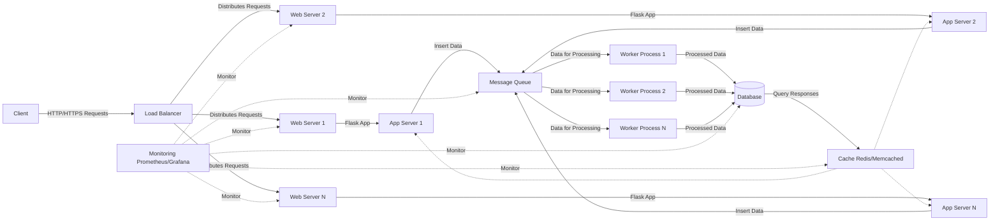

# hgpixel - Homegrown Web Pixel

Internet privacy got you down? Tired of using AdBlockers in your browser to stop pesky advertisers tracking your internet history? Sad you can't get a piece of the pie?

Write your own super-duper web tracking pixel today! Simply embed the pixel script on any website you own, and voila! You can start harvesting precious user data instantly! No data privacy requirements needed!

_GDPR? CCPA? Never heard of her!_

# Requirements
* Python 3.9+
* A smile on your face
* An absence of a human heart

# Setup

1. Clone the repository to your local overpowered calculator.

2. Install the required Python packages:
`pip install -r requirements.txt`

3. Install the pixel embed code from `pixeljs/embed.html` into your website.
   - This script should be placed in the `<head>` tag on each page you want to track.
4. Edit the server endpoint URL in the embed code and `pixeljs/app.js`
5. Run the Flask server:
`flask run`

## Tracking Pixel Usage
Once the pixel is embedded in your website, it will start sending data to the Flask server. 
The pixel tracks various user interactions such as clicks, page views, user's favourite colour and more.

## Viewing Collected Data
To view the collected data, navigate to `http://127.0.0.1:5000/view-data` in your web browser. 
This page uses DataTables to display the tracking data, allowing you to sort, filter, and group the data for analysis (machine-learning algorithms to steal the user's money is not included).

# TODO:
* __Implement Time Travel__: Add a feature to track users before they even visit the website. Preemptive analytics, anyone?

* __Telepathy Module__: Why stop at clicks and page views? Let's track users' thoughts too! (telepathy.js coming soon).

* __Mood Ring Integration__: Sync with users' mood rings to adjust website colors based on their emotional state. Happy users see rainbows!

* __AI Overlord__: Teach the pixel to become self-aware and take over the mundane tasks of world domination.

* __Universal Language Decoder__: Instantly translate alien languages. It's never too early to be GDPR non-compliant on Mars.

* __Personalized Weather Control__: Adjust the weather on users' location to keep them indoors and browsing more. More rain, more gain!

* __Magic 8-Ball Feature__: Because making data-driven decisions is so mainstream. Let's leave it to fate.

### Over-engineered Proposed Architecture - Diagram:
