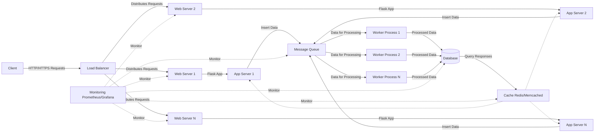

# hgpixel - Homegrown Web Pixel

Internet privacy got you down? Tired of using AdBlockers in your browser to stop pesky advertisers track your internet history? 

Write your own super-duper web tracking pixel today! Simply embed the pixel script on any website you own, and voila! You can start harvesting precious user data instantly! No data privacy requirements needed!
GDPR? Never heard of her!
## Requirements
* Python 3.9+
* A smile on your face

## Setup
Install the pixel embed code from `pixeljs/embed.html` into your website.

Run the flask server:
`flask run`

Architecture Diagram:
